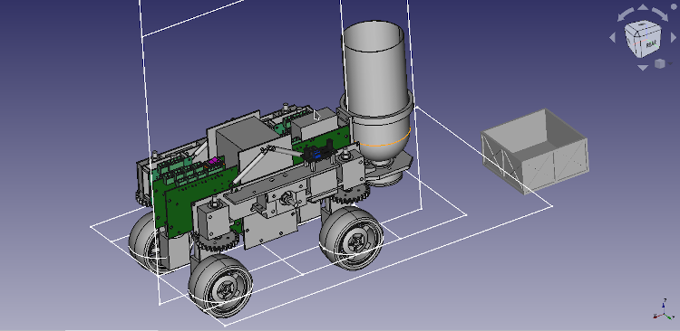

# Ollie the Tractor Robot

This is the design files for our PiWars 2022 robot.  It's a 4-wheel drive, 4-wheel steered tractor robot.

The theme for PiWars 2022 was farming and the design is based around a large 4 wheel tractor like the Claas Xerion.

This is the FreeCAD design for the robot, `new_wheel_assy.FCStd` ended up being not just the wheel but the whole thing.  It's built out of 3D printed parts, PCBs and some very simple aluminium parts made from 2mm and 3mm sheet material.
